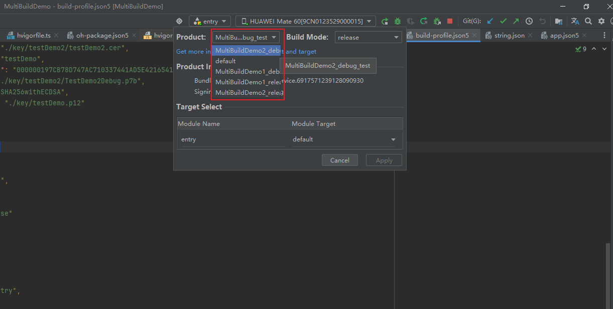
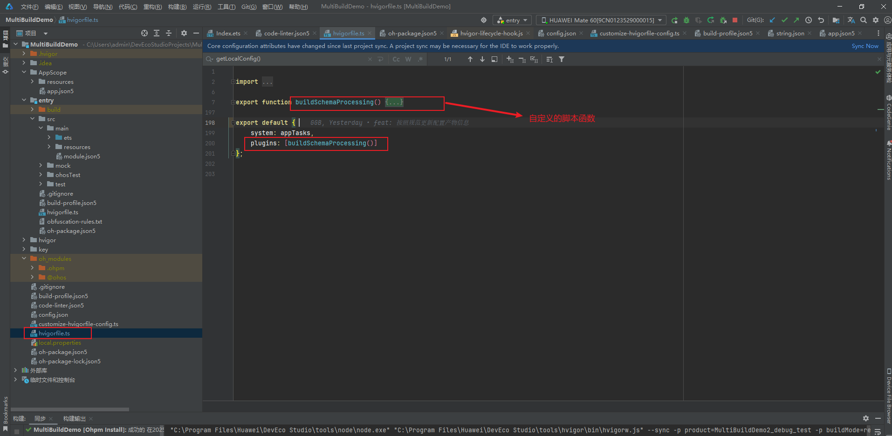

# One-Click Multi-Environment Build - Mastering HarmonyOS 5 with Hvigor

## Introduction

In HarmonyOS 5 application development, there is often a need to output multiple APP/HAP packages for different environments (test, pre-release, production) or different signatures (debug, release). Although HarmonyOS provides Multi-Target Build capability, allowing multiple products to be configured in the same project to generate multiple artifacts with different package names, certain deep customizations (such as dynamically modifying `client_id` and `app_id` in `module.json5`, or rewriting output package names based on build time) still require custom Hvigor plugins.

Combined with a sample project, this article demonstrates how to use Hvigor plugins with multi-target builds to achieve:

1. Unified management of configuration such as API URLs and tracking URLs for each environment;
2. Dynamic injection of application information like `clientId` and `appId`;
3. Customized output package names based on build time and product name for easier subsequent release and production troubleshooting.

## Ⅰ. Using Custom Hvigor Plugins in Projects

### 1. Entry Point of Hvigor Plugins

In the root directory of a HarmonyOS project, there is an entry file `hvigorfile.ts` where custom tasks are registered in `plugins`:

```typescript
// File: hvigorfile.ts  
import { buildSchemaProcessing } from './scripts/build-schema-processing';  

export default {  
  system: appTasks,             // Built-in Hvigor tasks, do not modify  
  plugins: [  
    buildSchemaProcessing()     // Custom plugin: dynamically modify module.json5, build-profile.json5, etc.  
  ]  
};  
```

Click **Sync Now** in DevEco Studio or run `hvigor sync` to load the plugin into the build process.

### 2. Overview of Common Hvigor APIs

In custom plugin code, we typically use the following core APIs:

- `hvigor.getRootNode()`: Get the root node to access plugin contexts
- `rootNode.getContext(pluginId)`: Get the context object of a specified plugin, e.g., `OHOS_APP_PLUGIN`, `OHOS_HAP_PLUGIN`
- `context.getAppJsonOpt()` / `getModuleJsonOpt()`: Read the AST object of `app.json5` or `module.json5`
- `context.getBuildProfileOpt()`: Read the AST object of the root directory `build-profile.json5`
- `context.setAppJsonOpt()` / `setBuildProfileOpt()`: Write modified AST back into the build process

```typescript
// Example: Reading context  
const root = hvigor.getRootNode();  
const appCtx = root.getContext(OhosPluginId.OHOS_APP_PLUGIN) as OhosAppContext;  
const hapCtx = root.getContext(OhosPluginId.OHOS_HAP_PLUGIN) as OhosAppContext;  
const appJson = appCtx.getAppJsonOpt();  
const modJson = hapCtx.getModuleJsonOpt();  
const buildProfile = appCtx.getBuildProfileOpt();  

// Need to re-set after modification  
appCtx.setAppJsonOpt(appJson);  
appCtx.setBuildProfileOpt(buildProfile);  
```



## Ⅱ. Combining Multi-Target Builds with Custom Plugins for Environment Switching

### 1. Standardizing Product Naming

To facilitate script parsing, we stipulate that the `name` of `product` uses underscore-separated fixed format:

```js
<app-identifier>_<signing-identifier>_<environment-identifier>  
```

e.g.: `demo1_debug_test`, `demo1_release_preRelease`, `demo2_debug_official`

Configure multiple products in `build-profile.json5`:

```json5
"products": [  
  {  
    "name": "demo1_debug_test",  
    "signingConfig": "debug",  
    "buildOption": {  
      "arkOptions": {  
        "buildProfileFields": {  
          "productsName": "demo1",  
          "buildTime": "",  
          "apiUrl": "",  
          "trackApiUrl": ""  
        }  
      }  
    }  
  },  
  {  
    "name": "demo1_release_officiallyReleased",  
    "signingConfig": "release",  
    "buildOption": { /* Same as above */ }  
  },  
  /* More product configurations... */  
]  
```

> **Tip**: Fields under `buildProfileFields` are injected at runtime for easy environment information retrieval in code.

### 2. Local Configuration File: `config.json`

Centralize API URLs for each environment and `clientId`/`appId` information for each application:

```json
{  
  "environmentInfo": {  
    "test": {  
      "apiUrl": "https://api.test.com",  
      "trackApiUrl": "https://stat.test.com"  
    },  
    "preRelease": {  
      "apiUrl": "https://api-pre.example.com",  
      "trackApiUrl": "https://stat-pre.example.com"  
    },  
    "officiallyReleased": {  
      "apiUrl": "https://api.prod.com",  
      "trackApiUrl": "https://stat.prod.com"  
    }  
  },  
  "appConfigInfo": {  
    "demo1": {  
      "clientId": "111898773",  
      "appId": "5765880207855284373"  
    },  
    "demo2": {  
      "clientId": "6917571239128090930",  
      "appId": "6917571239128090930"  
    }  
  }  
}  
```

Provide two helper functions for use in plugins:

```typescript
// scripts/config.ts  
import cfgRaw from '../config.json';  
import { format } from 'date-fns';  

export function formatBuildTime(date = new Date()): string {  
  const pad = (n: number) => String(n).padStart(2, '0');  
  return `${date.getFullYear()}-${pad(date.getMonth()+1)}-${pad(date.getDate())}`  
       + `_${pad(date.getHours())}-${pad(date.getMinutes())}-${pad(date.getSeconds())}`;  
}  

export function getLocalConfig() {  
  const cfg = JSON.parse(JSON.stringify(cfgRaw));  
  cfg.buildTime = formatBuildTime();  
  return cfg;  
}  
```

### 3. Core Logic of Plugin Implementation

In `build-schema-processing.ts`, use Hvigor lifecycle hooks to complete configuration injection and artifact renaming:

```typescript
// scripts/build-schema-processing.ts  
import { getLocalConfig } from './config';  

export function buildSchemaProcessing() {  
  const localCfg = getLocalConfig();  
  let currentProduct = '', versionName = '', bundleName = '', appConfig: any;  

  return {  
    pluginId: 'custom-build-processor',  
    apply(hvigor) {  
      hvigor.getRootNode().afterNodeEvaluate(root => {  
        // Get context  
        const appCtx = root.getContext(OhosPluginId.OHOS_APP_PLUGIN) as OhosAppContext;  
        const hapCtx = root.getContext(OhosPluginId.OHOS_HAP_PLUGIN) as OhosAppContext;  
        const buildProfile = appCtx.getBuildProfileOpt();  
        const appJson = appCtx.getAppJsonOpt();  
        const modJson = hapCtx.getModuleJsonOpt();  

        // Current product info  
        currentProduct = appCtx.getCurrentProduct().getProductName() || '';  
        versionName = appJson.app.versionName;  
        const productKeys = currentProduct.split('_');  
        const appKey = productKeys[0];  
        const envKey = productKeys[2];  
        appConfig = localCfg.appConfigInfo[appKey];  
        const envConfig = localCfg.environmentInfo[envKey];  

        // Inject clientId and appId into app.json5  
        if (modJson) {  
          modJson['module']['appId'] = appConfig.appId;  
          modJson['module']['clientId'] = appConfig.clientId;  
          hapCtx.setModuleJsonOpt(modJson);  
        }  

        // Traverse products to inject environment/time and rename artifacts  
        (buildProfile.app.products || []).forEach((prd: any) => {  
          prd.buildOption.arkOptions.buildProfileFields.buildTime  = localCfg.buildTime;  
          prd.buildOption.arkOptions.buildProfileFields.apiUrl     = envConfig.apiUrl;  
          prd.buildOption.arkOptions.buildProfileFields.trackApiUrl= envConfig.trackApiUrl;  

          const suffix = `${appKey}_${versionName}_${localCfg.buildTime}`;  
          if (prd.name === currentProduct) {  
            bundleName = prd.bundleName || appJson.app.bundleName;  
          }  
          prd.output.artifactName = `AtomicPlatform-${suffix}`;  
        });  

        appCtx.setBuildProfileOpt(buildProfile);  
      });  

      hvigor.buildFinished(() => {  
        console.log(`📅 Build Time: ${localCfg.buildTime}`);  
        console.log(`📦 Current Artifact: ${currentProduct}`);  
        console.log(`🔖 Bundle Name: ${bundleName}`);  
        console.log(`🆔 ClientID: ${appConfig.clientId}`);  
        console.log(`🆔 AppID: ${appConfig.appId}`);  
      });  
    }  
  };  
}  
```



## Ⅲ. Operation Results and Log Verification

Run `hvigor build` to see injection and renaming results in logs:

```
====================== Build Package Information ======================  
📅 Build Time:  2025-04-24_09-32-05  
📦 Current Artifact: demo2_debug_test  
🔖 Bundle Name: com.atomicservice.6917571239128090930  
🆔 ClientID: 6917571239128090930  
🆔 AppID: 6917571239128090930  
====================================================  
```

Meanwhile, the output HAP package will be named:

```
AtomicPlatform-demo2_1.0.0_2025-04-24_09-32-05.hap  
```

This approach automatically completes configuration injection and artifact renaming for each build in different products/environments, significantly improving multi-environment development and release efficiency.

## Ⅳ. Conclusion

- **Unified Management**: Centralize environment and application information in `config.json` for easy maintenance and extension;
- **Automatic Injection**: Use Hvigor plugins to dynamically modify `module.json5` and `build-profile.json5` during build, eliminating manual switching;
- **Custom Artifacts**: Customize output package names based on build time and product name for easier version tracking and production troubleshooting.

Future enhancements to the plugin could include:

1. Automatic upload of build reports to CI/CD platforms;
2. Auto-generation of HTML reports for build difference comparison;
3. Integration with Git commit and release workflows to trigger reviews or pushes after builds.

## Ⅴ. Source Code Repository

### Repository Branch: feature/hvigorfileBuild

Repository URL: [MultiBuildDemo: Build Multi-Target Artifacts - Gitee.com](https://gitee.com/qq1963861722/MultiBuildDemo/tree/feature%2FhvigorfileBuild/)

## Ⅵ. Reference Documentation

[Extending Build - Compilation and Build - DevEco Studio - Huawei HarmonyOS Developer](https://developer.huawei.com/consumer/cn/doc/harmonyos-guides/ide-build-expanding)
 [How to Build Applications with Different Package Names in HarmonyOS 5 Compilation](https://juejin.cn/post/7495635442056331273)
 [One-Click Building of APP and HAP Packages with Multi-Environment, Multi-Channel, Custom Path Output, and Custom Names in HarmonyOS](https://juejin.cn/post/7427050728719368202)
