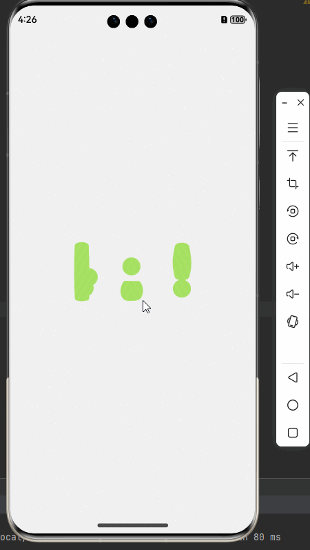
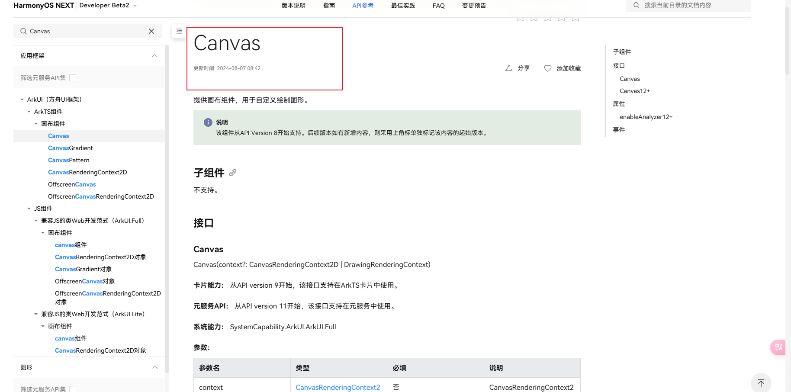

# 【Harmony 5】Learn to Create a Splash Animation Before Qixi Festival to Win Your Colleague's Heart

An excellent project needs a high-class animation to kick off. Below is a three-step guide to quickly implement a splash animation for HarmonyOS apps.



## 1. Create a Window

Use `windowStage.createSubWindow("splash_window")` [Create Window](https://developer.huawei.com/consumer/cn/doc/harmonyos-references-V5/js-apis-window-V5#windowcreatewindow9) to manage windows and implement the splash animation loading.


Create and operate the window within the UIAbility lifecycle:

```tsx
async onWindowStageCreate(windowStage: window.WindowStage) {  
  // Main window is created, set main page for this ability  
  hilog.info(0x0000, 'testTag', '%{public}s', 'Ability onWindowStageCreate');  
  actionWindowStageCreate(windowStage);  
  const win = await windowStage.createSubWindow("splash_window"); // Create window  
  await win.showWindow(); // Display window  
  win.setUIContent("pages/SplashPage"); // Set splash animation page  
  windowStage.loadContent('pages/YoutubePage', (err) => { // Load main entry of the project  
    if (err.code) {  
      hilog.error(0x0000, 'testTag', 'Failed to load content: %{public}s', JSON.stringify(err) ?? '');  
      return;  
    }  
    hilog.info(0x0000, 'testTag', 'Succeeded in loading content.');  
  });  
}  
```

## 2. Implement Animation Effects with Canvas Component



**Canvas Animation Implementation**

```tsx
private mainRenderingSettings: RenderingContextSettings = new RenderingContextSettings(true);  
private mainCanvasRenderingContext: CanvasRenderingContext2D =  
  new CanvasRenderingContext2D(this.mainRenderingSettings);  
private animationItem?: AnimationItem;  
private path: string = "/lotties/ani_splash.json";  
@State pageOpacity: number = 1;  

Canvas(this.mainCanvasRenderingContext)  
  .height(375)  
  .width(375)  
  .onReady(() => {  
    // Anti-aliasing settings  
    this.mainCanvasRenderingContext.imageSmoothingEnabled = true;  
    this.mainCanvasRenderingContext.imageSmoothingQuality = 'medium';  
    this.animationItem = lottie.loadAnimation({  
      container: this.mainCanvasRenderingContext, // Rendering context  
      renderer: 'canvas',                       // Rendering mode  
      loop: false,                               // No loop  
      autoplay: true,                            // Autoplay  
      contentMode: 'Fill',                       // Fill mode  
      frameRate: 60,                             // Frame rate  
      path: this.path,                           // JSON data path  
    });  
  });  
.backgroundColor(Color.White)  
.align(Alignment.Center)  
.size(matchSize);  
```

## 3. Self-Management of Windows

The window must be closed to display the main entry window after creation. A good window should close automatically after the splash animation finishes, similar to closing an ad after it plays.

**Implement with a Timer** (or place the closing action in the animation completion event):

```tsx
timer: number = -1;  
closeWin() {  
  window.findWindow("splash_window").destroyWindow();  
}  
adTime: number = 0;  
aboutToAppear() {  
  ScreenUtil.init(this);  
  ScreenUtil.setFullScreen(true);  
  this.timer = setInterval(() => {  
    if (this.adTime === 0) {  
      clearInterval(this.timer);  
      this.closeWin();  
      return;  
    }  
    this.adTime--;  
  }, 2800);  
}  
```

Core API: `window.findWindow("splash_window").destroyWindow()`
 Since we used the keyword "splash_window" when creating it, use **window.findWindow** to retrieve and operate on this window.

**Complete Splash Page Code:**

```tsx
/**  
 * Splash Page  
 */  
import { router, window } from '@kit/ArkUI';  
import lottie, { AnimationItem } from '@ohos/lottie';  
import { LogUtil } from '../utils/LogUtil';  
import { ScreenUtil } from '../utils/ScreenUtil';  
import { windowManager } from '../utils/windowManager';  

let matchSize: SizeOptions = {  
  width: "100%",  
  height: "100%"  
};  

@Entry  
@Component  
struct SplashPage {  
  private mainRenderingSettings = new RenderingContextSettings(true);  
  private mainCanvasRenderingContext = new CanvasRenderingContext2D(this.mainRenderingSettings);  
  private animationItem?: AnimationItem;  
  private path = "/lotties/ani_splash.json";  
  @State pageOpacity = 1;  

  build() {  
    Stack() {  
      Canvas(this.mainCanvasRenderingContext)  
        .height(375)  
        .width(375)  
        .onReady(() => {  
          this.mainCanvasRenderingContext.imageSmoothingEnabled = true;  
          this.mainCanvasRenderingContext.imageSmoothingQuality = 'medium';  
          this.animationItem = lottie.loadAnimation({  
            container: this.mainCanvasRenderingContext,  
            renderer: 'canvas',  
            loop: false,  
            autoplay: true,  
            contentMode: 'Fill',  
            frameRate: 60,  
            path: this.path,  
          });  
        });  
    }  
      .backgroundColor(Color.White)  
      .align(Alignment.Center)  
      .size(matchSize);  
  }  

  timer = -1;  
  adTime = 0;  

  closeWin() {  
    window.findWindow("splash_window").destroyWindow();  
  }  

  aboutToAppear() {  
    ScreenUtil.init(this);  
    ScreenUtil.setFullScreen(true);  
    this.timer = setInterval(() => {  
      if (this.adTime === 0) {  
        clearInterval(this.timer);  
        this.closeWin();  
        return;  
      }  
      this.adTime--;  
    }, 2800);  
  }  

  aboutToDisappear(): void {  
    windowManager.settingBarBlank();  
  }  

  pageTransition() {  
    PageTransitionExit({ duration: 1000, curve: Curve.Ease })  
      .opacity(0);  
  }  
}  
```