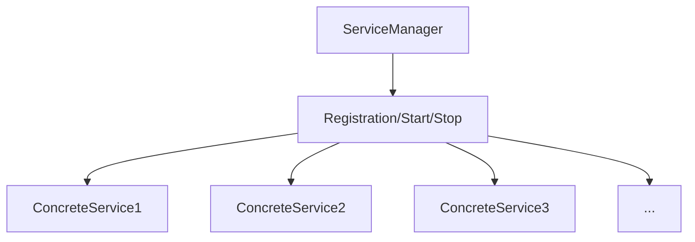

# Exploration of Engineering in HarmonyOS 5 Applications: Modular and Concurrent Service Design Driven by the Cangjie Language

With the full-scale application of HarmonyOS 5, the scale and complexity of applications continue to rise. In the process of actual project development, I deeply realized that only by combining a reasonable modular architecture design with an efficient concurrent processing framework can we truly support the development of large-scale and high-quality HarmonyOS 5 applications.

This article combines practical project experience and, based on the Cangjie language, explores how to build an application framework with clear modularization, concurrent friendliness, and unified interface specifications.

## 1. Modular Design Principles

### Goals and Pain Points

In the initial stage of projects, many applications adopt a "function-stacking" development method, which leads to a series of problems:

1. **Function Fragmentation**: There is serious coupling among modules, the structure is chaotic, and a modification in one place often triggers a chain reaction, affecting the entire system.
2. **Difficulty in Expansion**: When introducing new functions, it is often necessary to refactor a large amount of old code, which incurs high development costs and risks.
3. **Performance Bottlenecks**: The serial task-processing method easily causes resource waste, increases system latency, and reduces overall performance.

To solve these problems, in HarmonyOS 5 projects, we follow the following modular design principles:

| Design Principle      | Explanation                                                  |
| --------------------- | ------------------------------------------------------------ |
| Single Responsibility | Each module is only responsible for a specific type of function, such as data collection, processing, or display. |
| Clear Boundaries      | Modules expose functions through interfaces, and other modules do not directly access their internal details to ensure independence and security. |
| Generic Encapsulation | For public components, such as repositories and task schedulers, use generics to improve code reusability. |
| Convenient Expansion  | Adding new modules does not affect the normal operation of existing modules, achieving low coupling and high cohesion. |

### The Cangjie Language Empowers Modularization

The features of the Cangjie language—such as the generic system, interfaces, type inference, and type extension—are highly compatible with the above design principles:

1. Use generic interfaces to unify the interaction methods between modules, enhancing compatibility and generality.
2. Use the extension mechanism to enhance system functions based on actual requirements, improving flexibility.
3. Leverage type inference and named parameters to improve the flexibility of module combinations and reduce development complexity.

## 2. Concurrent Service Framework Construction

In practical HarmonyOS 5 application scenarios, many tasks—such as data collection, network requests, and state synchronization—are essentially asynchronous and concurrent. To achieve efficient scheduling, we designed a service management framework based on Cangjie's concurrent mechanism.

### Service Model Design



1. `ServiceManager` is responsible for unified registration, starting, and stopping of all services.
2. Each service module must implement the `Service` interface to ensure consistency and standardization.
3. All services run in independent lightweight threads to achieve concurrent processing and improve system responsiveness and efficiency.

### Core Interface Definition

```csharp
public interface Service {
    func start(): Unit
    func stop(): Unit
}
```

This interface is simple and clear. All services only need to implement the `start` and `stop` methods to conform to the unified lifecycle management specification.

### Service Manager Implementation

```csharp
import runtime.thread

public class ServiceManager {
    private let services = concurrent.ArrayList()

    public func register(s: Service) {
        services.add(s)
    }

    public func startAll() {
        for (let s in services) {
            thread.start {
                s.start()
            }
        }
    }

    public func stopAll() {
        for (let s in services) {
            s.stop()
        }
    }
}
```

1. Uses concurrency-safe `ArrayList` to store service instances, ensuring thread-safe management.
2. Each service is started in an independent thread to achieve concurrent execution.
3. The `stopAll()` method gracefully stops all registered services.

### Example: Specific Service Modules

```csharp
public class NetworkSyncService <: Service {
    public override func start(): Unit {
        while (true) {
            println("Syncing with cloud...")
            sleep(5 * Duration.Second)
        }
    }

    public override func stop(): Unit {
        println("NetworkSyncService stopping...")
    }
}

public class SensorMonitorService <: Service {
    public override func start(): Unit {
        while (true) {
            println("Monitoring sensor data...")
            sleep(2 * Duration.Second)
        }
    }

    public override func stop(): Unit {
        println("SensorMonitorService stopping...")
    }
}
```

### Main Process for Starting the Application

```csharp
main() {
    let manager = ServiceManager()
    manager.register(NetworkSyncService())
    manager.register(SensorMonitorService())

    manager.startAll()

    // Keep the main thread running
    while (true) {
        sleep(10 * Duration.Second)
    }
}
```

## 3. Type Safety and Interface Standardization

### Why Pursue Unified Interfaces?

In complex systems, the absence of clear contractual interaction between modules often leads to:

1. Inconsistent parameters, leading to failed calls and system instability.
2. Confused dependency relationships, making testing difficult and increasing maintenance costs.
3. Poor scalability, making it expensive to add new modules, hindering upgrades.

### The Cangjie Language Helps Standardize Interfaces

1. **Named Parameters + Default Values**: Make calls clearer and more intuitive, reducing bugs and improving maintainability.
2. **Type Inference**: Reduces explicit type declarations, minimizing developer errors.
3. **Generic Interfaces**: Abstract input/output differences, improving compatibility across modules.

### Example: Unified Service Registration Interface

Define a generic registration function:

```csharp
func registerService(manager: ServiceManager, service!: T) {
    manager.register(service)
}
```

Usage example:

```csharp
registerService(manager, service: NetworkSyncService())
registerService(manager, service: SensorMonitorService())
```

To register a new service in the future:

```csharp
registerService(manager, service: NewCustomService())
```

This approach requires no modification to the core framework, providing excellent scalability.

## Summary

This case study demonstrates how to use the Cangjie language to build an engineering application infrastructure in HarmonyOS 5 with the following characteristics:

1. **Clear module boundaries** for easier development and maintenance.
2. **Unified interface specifications** to reduce coupling and enhance compatibility.
3. **Efficient concurrent processing** to utilize system resources and improve responsiveness.
4. **Flexible expansion** to meet evolving business requirements.

### Key Takeaways

| Technical Point               | Practical Value                                              |
| ----------------------------- | ------------------------------------------------------------ |
| Generic Interface             | Abstracts and unifies module protocols, improving compatibility. |
| Lightweight Threading         | Enables efficient execution and enhances user experience.    |
| Named Parameters and Defaults | Reduces misuse and improves code readability.                |
| Concurrent Object Library     | Ensures safe multi-service management and system reliability. |

This architectural pattern is not only suitable for IoT device platforms and multi-service scheduling but also for backend module management in large-scale mobile apps.

In the future, by combining more advanced Cangjie features—like the concurrent Actor model and microkernel componentization—this framework can evolve into a more flexible, scalable microservice-based architecture to meet increasingly complex requirements.