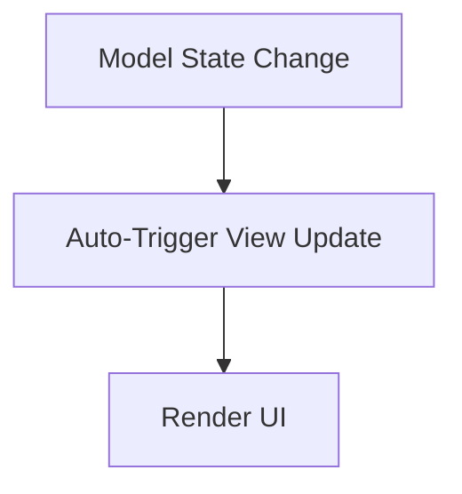

# HarmonyOS 5 Smart Terminals Hands-On: Building Responsive UI and State Management with Cangjie Language

In the era of HarmonyOS 5, the diversity of devices has expanded to include smartphones, smartwatches, smart screens, and IoT mini-terminals. Against this backdrop, user experience has become a critical factor in the success of applications. Developing smooth responsive interfaces and ensuring consistent system stability across dynamic states are challenges that every developer must address.

This article presents a hands-on implementation of a lightweight, elegant, and high-performance responsive UI and state management system using the Cangjie language, balancing performance experience with clear architectural design.

------

## 1. Responsive Architecture Design

### Why Responsive UI?

Traditional imperative UI update methods look like this:

```cangjie
if (dataChanged) {
    updateUI()
}
```

This approach has several issues:

1. Scattered update logic prone to omissions and errors.
2. Difficulty synchronizing data state changes with UI updates.
3. Complex system maintenance and scaling.

The responsive UI model features automatic UI updates triggered by data changes, offering these advantages:

1. Clear data-driven principles make UI updates intuitive.
2. Unified update channels simplify management and maintenance.
3. Easier extension and testing.

------

### How Cangjie Language Helps

1. **Property Mechanism (`prop` / `mut prop`)**: Transparently encapsulates getters/setters to monitor data changes.
2. **Pipeline Operator (`|>`) + Lambda**: Builds clear data processing chains for optimized workflows.
3. **Trailing Lambda**: Makes control logic closer to natural language, improving code readability.
4. **Lightweight Threads**: Ensures UI updates do not block the main process, maintaining smooth operation.

------

### Architecture Diagram



The core idea is to decouple Model and View for automatic change detection.

------

## 2. Building the State Management Model

### Basic State Model Design

Use **Algebraic Data Types (ADT)** to manage application states and pattern matching (`match-case`) to dispatch update logic.

#### Define State Enum

```cangjie
enum UIState {
    | Loading
    | Loaded(String)
    | Error(String)
}
```

- Explicitly lists all valid states.
- Each state can carry relevant data (e.g., success data or error messages).

------

#### Define View Controller

```cangjie
class ViewController {
    mut prop currentState: UIState {
        get() {
            _state
        }
        set(newState) {
            _state = newState
            this.render(newState)
        }
    }

    private var _state: UIState = Loading

    private func render(state: UIState) {
        match(state) {
            case Loading => println("UI: Loading...")
            case Loaded(data) => println("UI: Displaying ${data}")
            case Error(msg) => println("UI: Error - ${msg}")
        }
    }
}
```

- `currentState` is a mutable property (`mut prop`).
- Assigning to it automatically triggers rendering logic—no manual `updateUI` calls needed.

------

#### Simulate State Transitions

```cangjie
main() {
    let controller = ViewController()

    thread.start {
        sleep(2 * Duration.Second)
        controller.currentState = Loaded("Sensor Data: 25°C")

        sleep(3 * Duration.Second)
        controller.currentState = Error("Connection lost")
    }

    while (true) {
        sleep(10 * Duration.Second)
    }
}
```

**Output Example**:

```
UI: Loading...
UI: Displaying Sensor Data: 25°C
UI: Error - Connection lost
```

------

### Key Design Points

| Technical Point          | Role                             |
| ------------------------ | -------------------------------- |
| Property-based listening | Transparently triggers rendering |
| ADT for state management | Ensures state completeness       |
| Pattern matching         | Clearly handles each state case  |

This model is clearer, more organized, and more scalable than traditional `if-else` logic.

------

## 3. Enhancing Performance and Experience

### How to Ensure Smoothness During High-Frequency Updates?

1. **Lightweight Thread Updates**: Separate UI update triggers from data collection to avoid blocking.
2. **Batch Rendering**: Merge multiple state changes to reduce UI refresh frequency and improve performance.
3. **Pipeline Data Processing**: Use Cangjie’s pipeline operators to optimize data handling chains.

------

### Example: Data Stream + Batching Optimization

```cangjie
class DataProvider {
    let updates = concurrent.Queue()

    public func push(state: UIState) {
        updates.enqueue(state)
    }

    public func listenUpdates(viewController: ViewController) {
        thread.start {
            while (true) {
                if (let state = updates.dequeue()) {
                    viewController.currentState = state!!
                }
            }
        }
    }
}

main() {
    let viewController = ViewController()
    let dataProvider = DataProvider()

    dataProvider.listenUpdates(viewController)

    thread.start {
        dataProvider.push(Loading)
        sleep(1 * Duration.Second)
        dataProvider.push(Loaded("Humidity: 45%"))
        sleep(2 * Duration.Second)
        dataProvider.push(Error("Sensor failure"))
    }

    while (true) {
        sleep(10 * Duration.Second)
    }
}
```

- `DataProvider` uses a concurrency-safe queue to collect state changes.
- An independent thread listens and pushes states to `ViewController`.
- The main thread remains unblocked for smooth operation.

------

## Summary

The responsive UI and state management system built with Cangjie language has these characteristics:

| Characteristic          | Description                                             |
| ----------------------- | ------------------------------------------------------- |
| Clear data-driven 架构  | `State = UI`; no manual update triggers                 |
| Easy to extend/maintain | Add new states via pattern matching                     |
| High-performance        | Lightweight threads + batching for seamless transitions |
| Clean code              | Lambda and pipeline operators enhance readability       |

This model is suitable for HarmonyOS 5 development in scenarios such as:

1. Real-time smart screen display systems
2. IoT device interaction interfaces
3. Data visualization dashboards
4. Smart terminal control panels

In the future, combining Cangjie’s Async Stream and composable UI frameworks (e.g., ArkTS patterns) could further evolve this into a true **Declarative Reactive UI** system.